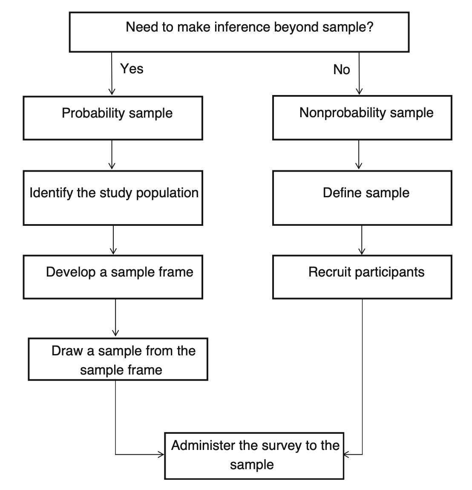
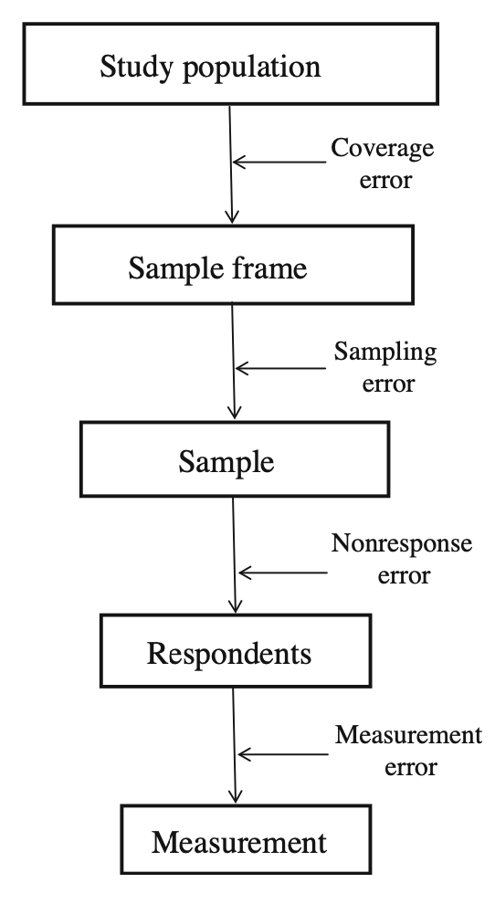

## Before class

- Champ, “Collecting Nonmarket Valuation Data” [@champ2017collecting].

Readings and course handouts are available on [Canvas](https://colostate.instructure.com/courses/230315/pages/readings).

## Begin with the question

- What population does the research question concern?
- What outcome or preference must be measured?
- Who can provide that information?
- What would make an answer informative for the proposed decision?

Data quality is part of research design.

## Theory and data inform each other

A framework guides what we collect. Available data may also suggest a useful question.

In either direction, return to the question, mechanism, and target population before choosing an analysis.

## Primary and secondary data

| Primary | Secondary |
|:---|:---|
| Collected for your research purpose | Collected for another purpose |
| More control over instrument and sampling | Often lower acquisition cost |
| Responsibility for collection quality | Responsibility for understanding provenance and limitations |

Neither category guarantees valid measurement.

## Trust requires institutional knowledge

- Who collected the data, and for what purpose?
- What incentives did respondents and collectors face?
- What checks were performed?
- What documentation would allow you to assess quality?

An unfamiliar value can be an error, a coding convention, or an important observation.

## Define the population and frame

- **Target population:** the group about which you want to make claims.
- **Sampling frame:** the list or mechanism used to reach that group.
- **Sample:** selected units.
- **Respondents:** selected units from whom data are obtained.

Example: a homeowner list will not cover all residents if renters matter.

::: notes
Preserves the homeowner/renter coverage example in the Unit 5 speaker notes.
:::

## Probability and nonprobability samples {.dense}

{height=430px}

Source: Champ; figure retained from Unit 5, slide 13.

## Where errors can enter {.dense}

{height=430px}

Source: Champ; figure retained from Unit 5, slides 14–15.

## Nonresponse is more than a small sample

- A low response rate reduces the amount of information.
- Bias depends on how response relates to the outcome.
- Compare available respondent characteristics with the frame.
- Such comparisons cannot rule out differences on unobserved characteristics.

Who might be missing from a survey of recreational users?

## Weights and uncertainty

- Unequal selection probabilities may require weights.
- Nonresponse adjustments depend on assumptions.
- Standard errors should account for the survey design where relevant.
- A large sample does not repair an incorrect sampling frame.

## Write questions people can answer

- Ask about one concept at a time.
- Specify the reference period.
- Use clear, consistent response options.
- Avoid leading wording.
- Pretest how respondents interpret the question.

Source: @champ2017collecting.

## Exercise: repair a question

> Do you agree that our valuable local rivers should receive more funding so families can enjoy cleaner water and better fishing?

- How many concepts are combined?
- What is the payment mechanism?
- What exactly changes under the proposed policy?
- Rewrite the question and explain your choices.

::: notes
New exercise. A classroom revision is not a validated valuation instrument.
:::

## Mode and administration

- Interviewers can clarify questions but may influence responses.
- Self-administered surveys provide privacy but less clarification.
- Online recruitment changes who is reached and who participates.
- Plan consent, confidentiality, and institutional review before collection.

## Processing is part of collection

- Define codes before data entry.
- Distinguish missing, inapplicable, refused, and zero.
- Preserve original responses.
- Document corrections and transformations.
- Check permissible values and inconsistent combinations.

## Discussion: Champ

For a proposed nonmarket valuation study:

1. Who is affected by the environmental change?
2. Does the sampling frame include them?
3. Which survey mode would you choose?
4. Which error is the largest threat?
5. What pretest would reveal a problem before launch?

## Workshop: collection plan

Use the course data checklist to specify:

- Research question and target population.
- Frame and recruitment method.
- Key outcome and proposed question.
- Likely coverage or nonresponse problem.
- One design change that reduces that problem.

The checklist and Champ example are on Canvas.

## Before you leave

Name the largest threat to your collection plan. Explain why increasing the sample size would or would not address it.

## References {.smaller}

::: {#refs}
:::

## Course navigation

- [All lectures](lectures.qmd)
- [Schedule and preparation](../2026/schedule.qmd)
- [Course reading list](../2026/readings.qmd)
