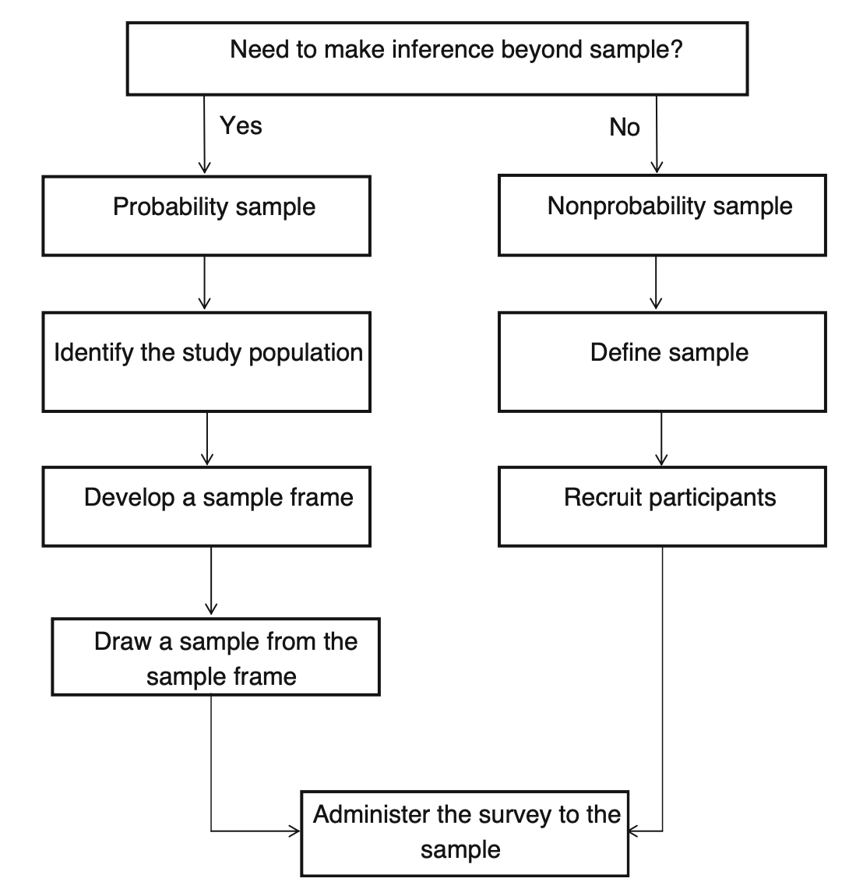
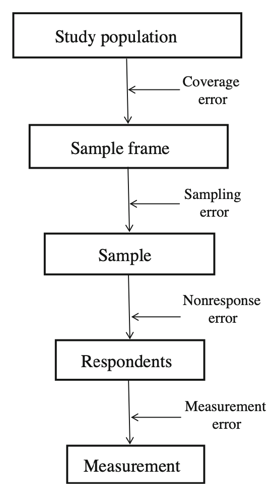

## Reading and sequence

**Champ, “Collecting Nonmarket Valuation Data”** [@champ2017collecting]

1. Choose between primary and secondary data
2. Define the population frame and sampling approach
3. Translate the desired measures into survey questions
4. Select the mode and fieldwork procedures
5. Process and document the completed data

::: notes
Champ presents these as connected decisions shaped by the research objective budget time and available labor. The lecture follows that sequence using one illustrative nonmarket valuation study.
:::

## Example: valuing a river restoration program

**Illustrative policy decision**

A county is considering restoration of ten miles of a local river to improve water quality habitat and recreation

::: {.fragment}
**Financing**

The program would be funded by an annual household fee for five years
:::

::: {.fragment}
**Research objective**

Estimate county households' willingness to pay for the specified program
:::

::: notes
This is a classroom example rather than a description of a proposed local policy. Keep the policy fixed throughout the lecture so that changes in the population frame question and mode can be interpreted against the same objective.
:::

## What is the data required?

The objective determines the data requirement.

The study needs information about:

- Conditions without the program
- The environmental change produced by the program
- Household choices when the program and payment are presented together
- Characteristics used to interpret differences in those choices

Water monitoring and visitation records can describe *parts* of the setting. However, they do not directly reveal choices for a program that does not yet exist.

## Primary and secondary data

| Primary data | Secondary data |
|---|---|
| Collected directly for the current study | Existing data reused for the current study |
| Instrument timing and recruitment can be tailored | Existing documentation design and variables set the limits |
| Research team controls and bears responsibility for collection | Research team must reconstruct provenance and fitness for use |
| Usually requires more time money and administration | Can reduce cost time and respondent burden |

Suitability depends on the question population measure and intended inference

## When is each source appropriate?

**Primary data are useful when**

- The required construct is absent from existing data
- The policy or choice is hypothetical
- The study requires tailored timing questions or recruitment

::: {.fragment}
**Secondary data are useful when**

- Existing measures correspond to the required concepts
- The population units timing and definitions fit the study
- Provenance and data-generating procedures can be assessed
:::

## Apply the distinction to our river study example

| Source | Potential use | Limitation |
|---|---|---|
| Water-quality monitoring | Describe baseline conditions | Does not measure household preferences |
| Recreation counts | Measure observed site use | Misses nonusers and passive-use values |
| Property transactions | Study capitalization near the river | Represents housing-market choices |
| Household survey | Present the proposed program and payment | Quality depends on sampling and survey design |

Note: The sources can complement one another when each has a defined role

## Discussion: choose a source for your research

For one current research question consider

1. Which concept must be observed
2. Whether an existing source measures that concept
3. Whether its population timing unit and definition fit
4. What primary collection would add
5. Which limitation would remain after combining sources

# Champ: Sampling and inference

## Data quality begins before the questionnaire

Champ treats high-quality data as a prerequisite for reliable and valid nonmarket values [@champ2017collecting]

The research objective determines

$$
\text{whose values matter}
\rightarrow
\text{who must be represented}
\rightarrow
\text{how they can be reached}
$$

A well-worded questionnaire cannot repair a frame that excludes part of the relevant population

## Who belongs in the river study population?

Possible beneficiaries include

- River users
- Residents living near the river
- County households that may pay the fee
- Nonusers who value habitat preservation
- People outside the county who visit or hold passive-use values

The policy question and payment jurisdiction determine which group the study is intended to represent

::: notes
Champ emphasizes that passive-use values make geographic boundaries difficult. For this example use county households as the target population because they face the policy choice and payment. Other objectives would imply another population.
:::

## Population frame sample and respondents

| Term | Example |
|---|---|
| **Study population** | County households whose values the study will represent |
| **Sampling frame** | Address list used to reach those households |
| **Sample** | Addresses selected from the frame |
| **Respondents** | Selected households that complete the survey |

Inference becomes less reliable when movement from one row to the next is selective

## Probability and nonprobability sampling

::: {.figure-center}
{height=475px fig-alt="Sampling decisions from the need for population inference to probability or nonprobability recruitment"}
:::

::: notes
Champ Figure 3.1. The first question is whether the study requires inference beyond the observed sample. Probability sampling gives each frame unit a known nonzero selection probability. Nonprobability recruitment does not.
:::

## Probability sampling designs answer different needs

**Simple random sample**

Every frame unit has the same probability of being chosen

::: {.fragment}
**Cluster sample**

Select geographic groups first when in-person collection makes travel costly
:::

::: {.fragment}
**Stratified random sample**

Divides the sample frame into nonoverlapping subpopulations (strata) based on some measure available for the entire sample frame, e.g., sample separately by characteristics such as distance from the river or urban and rural location
:::

## When is nonprobability sampling appropriate?

When inference to a broader population is not important.

Convenience, purposive and quota samples can support

- Focus groups and cognitive interviews
- Pilot testing
- Method comparisons
- Research restricted to the recruited participants

They do not provide known selection probabilities for population estimates

::: notes
Champ cautions against generalizing beyond a nonprobability sample. Matching or weighting on observed demographics does not reveal how the sample differs on unobserved determinants of the outcome.
:::

## Where errors enter the survey process

::: {.figure-center}
{height=470px fig-alt="Potential coverage sampling nonresponse and measurement errors from the study population through the final measurement"}
:::

::: notes
Champ Figure 3.2. Use the river example at every transition. An address frame can omit some households. A random sample differs from the frame by chance. Some sampled households do not respond. A completed answer can still mismeasure the intended preference.
:::

## Four errors require different responses

| Error | Question to ask | Possible response |
|---|---|---|
| **Coverage** | Who has no chance of appearing in the frame | Improve or combine frame sources |
| **Sampling** | How much does the selected sample vary by chance | Use design-based uncertainty and adequate sample size |
| **Nonresponse** | Does response relate to the outcome | Track response and compare observed characteristics |
| **Measurement** | Does the answer represent the intended construct | Revise and test the instrument |

::: notes
A larger sample primarily reduces sampling error. It does not correct coverage nonresponse or measurement error.
:::

## A good secondary source may still need supplementation

Before adding another source identify what is missing

- A variable needed for the model
- Coverage of part of the target population
- Observations from a different time or place
- Precision for a subgroup

The remedy depends on whether the new source adds information to existing units or adds new units to the sample

## Adding variables and adding observations differ

| Supplement | What can change |
|---|---|
| **Variables for sampled units** | Measurement definitions match quality and spatial or temporal scale |
| **Observations from another source** | Coverage recruitment selection probabilities weights and target population |

Adding a water-quality measure does not alter the original selection probabilities if all sampled units remain in the analysis. Dropping unmatched units can still make the analysis sample selective

Appending respondents from an online panel can change the sample design and the population represented

## Combining sources does not create a probability sample

Suppose an existing survey represents licensed anglers and an added intercept survey recruits people at river access points

The combined data still exclude

- Unlicensed users
- Residents who do not visit the river
- Households with passive-use values only

The two sources also have different selection mechanisms and may include some people twice

The combined sample may answer a question about recruited river users. It does not represent all county households without additional design information

## Discussion: audit a proposed data combination

For a combination relevant to your research consider

1. Whether the new source adds variables or observations
2. Which population each source represents
3. Whether units definitions and time periods align
4. Whether inclusion probabilities are known and compatible
5. Which inference remains defensible after the combination

# Champ: Questionnaire design

## Moving from the construct to the question

For each desired measure specify

1. The theoretical concept
2. The observable response needed
3. The question a respondent can understand
4. The response options or recording rule
5. The analysis variable and units

“Angling experience” could mean skill years fishing trip frequency or equipment use. 

The construct must be defined before it can be measured.

## A nonmarket valuation scenario needs defined components

The respondent needs to understand

- Baseline conditions without the program
- The specific environmental change
- How and when the program would be implemented
- The payment mechanism amount and duration
- The choice the respondent is being asked to make

The description should be accurate neutral and understandable to the study population

## Question-design checks

Before testing a question ask whether it

- Measures one defined concept
- Uses language familiar to respondents
- Provides a clear reference period
- Uses response options that match the question
- Avoids leading wording and unsupported information
- Places recall demands within what respondents can reasonably report

Question order can also affect answers and should be planned and tested

## Exercise: repair the valuation question

> Do you agree that our valuable local rivers should receive more funding so families can enjoy cleaner water and better fishing?

Use the preceding checks to identify

1. The undefined policy change
2. The missing payment mechanism
3. The concepts combined in one question
4. The words that encourage agreement
5. The choice the respondent is being asked to make

Draft a revision for the illustrative river program

## One possible revision

**Baseline** Without the program current river conditions are expected to continue

::: {.fragment}
**Program** The county would restore ten miles of river over five years with the stated changes described in the survey
:::

::: {.fragment}
**Payment** Each county household would pay an annual fee of \$X for five years
:::

::: {.fragment}
**Choice** If the program and fee appeared together on the ballot would you vote for or against the program
:::

::: notes
This is a classroom revision rather than a validated contingent valuation instrument. The environmental outcomes baseline implementation mechanism payment vehicle and consequentiality would require credible supporting detail and testing.
:::

## A possible revision still needs to be tested

Ask potential respondents

- What do you think the program would change
- What does the payment mean for your household
- Which information did you use to decide
- Which words were unclear or interpreted differently
- What assumptions did you make that were not stated

Cognitive (one-on-one) interviews reveal how respondents understand and answer the question

## Develop test and refine the instrument

**Develop and refine**

Focus groups $\rightarrow$ draft instrument $\rightarrow$ expert review $\rightarrow$ cognitive interviews

::: {.fragment}
**Test implementation**

Revised instrument $\rightarrow$ pilot survey $\rightarrow$ final instrument
:::

Revisions can change the questions recruitment materials mode and field procedures

::: notes
Champ notes that the final questionnaire may bear little resemblance to the first draft. A pilot also provides information about response rates implementation costs follow-up needs and the distribution of willingness to pay.
:::

## Mode changes the data-generating process

| Self-administered | Interviewer-administered |
|---|---|
| Lower cost per response in many settings | Greater control over eligibility order and completion |
| Privacy and respondent pacing | Ability to clarify a complex instrument |
| Requires literacy and clear instructions | Requires trained interviewers |
| Greater risk of unanswered or reordered questions | Greater risk of interviewer and social-desirability effects |

Online mail phone and in-person modes also reach different people and can produce different response patterns

# Best practices: Fieldwork processing and documentation

## Fieldwork begins before the first response

A sound primary data collection process requires researchers to prepare a written protocol for

- Eligibility and recruitment
- Consent and confidentiality
- Survey administration and permitted clarification
- Follow-up contacts
- Tracking responses and field outcomes
- Escalating unexpected situations
- Protecting identifiers and survey data

Institutional review and data-security requirements should be resolved before collection

## Train interviewers and enumerators

Training should cover

- The study purpose without coaching a preferred response
- Standard wording order and neutral probes
- Eligibility consent and confidentiality procedures
- Practice interviews and feedback
- Recording refusals partial interviews and deviations
- Procedures for technical or safety problems

Supervisors should confirm that each enumerator can administer the protocol consistently before fieldwork

## Quality assurance during collection

- Track invitations contacts completions refusals and ineligible cases
- Review early records before collection accelerates
- Check ranges skips duplicates timestamps and unusual patterns
- Debrief enumerators and document protocol deviations
- Preserve the original response before any correction
- Compare early and late respondents when useful

Quality checks should identify both data errors and failures in the collection process

## Write the codebook before collection

For every field record

- Variable name and label
- Exact question or source
- Unit and reference period
- Allowed values and labels
- Codes for missing refused and not applicable
- Skip logic
- Derived-variable rule
- Instrument and codebook version

Writing the codebook early exposes questions that cannot yet be coded consistently

## Zero, missing, refused, and not applicable differ

Consider annual river visits

| Recorded value | Meaning |
|---|---|
| `0` | Respondent made no visits |
| `NA_DK` | Respondent does not know |
| `NA_REF` | Respondent refused |
| `NA_SKIP` | Question did not apply because of the survey path |
| blank | Collection or processing status is unresolved |

Collapsing these values changes the meaning of the analysis variable

## Documentation supports assessment and reuse

Document while the study is in progress

- Study objective and protocol
- Population frame and sample selection
- Instrument recruitment scripts and contact dates
- Pilot changes and instrument versions
- Fieldwork training costs and deviations
- Codebook cleaning rules and validation checks
- Final sample disposition and summary statistics
- Raw-data archive access and confidentiality conditions

## Discussion: field practices from experience

What is one practice you have used or learned from an advisor mentor or field team?

1. Was this a practice that occurred before, during, or after collection?
2. Which failure was is intended to prevent?
3. Could it apply broadly or does it depend on the study context?

::: notes
Organize contributions on the board under before collection during collection and after collection. Distinguish a documented quality-control procedure from a preference that may be specific to one field setting.
:::

## Apply Champ to your research

For one data source in your project explain

1. Why primary or secondary data are appropriate
2. Which population the study is intended to represent
3. How units enter the observed sample
4. Which error is the largest threat to inference
5. How the key measure will be tested or validated
6. Which fieldwork and documentation record another researcher would need

## Summary

**Source choice** follows from the research objective and required measure

**Sampling** determines which population can be represented

**Questionnaire design** turns concepts into responses that can be interpreted

**Fieldwork and processing** determine whether the design is implemented consistently

**Documentation** makes those decisions assessable and reproducible

## References {.smaller}

::: {#refs}
:::

## Course navigation

- [All lectures](https://laurenchenarides.github.io/csu-arec-570/lectures/lectures.html)
- [Schedule and preparation](https://laurenchenarides.github.io/csu-arec-570/2026/schedule.html)
- [Course reading list](https://laurenchenarides.github.io/csu-arec-570/2026/readings.html)
- [Download this lecture as a PDF](https://laurenchenarides.github.io/csu-arec-570/lectures/lecture5.1.pdf)
