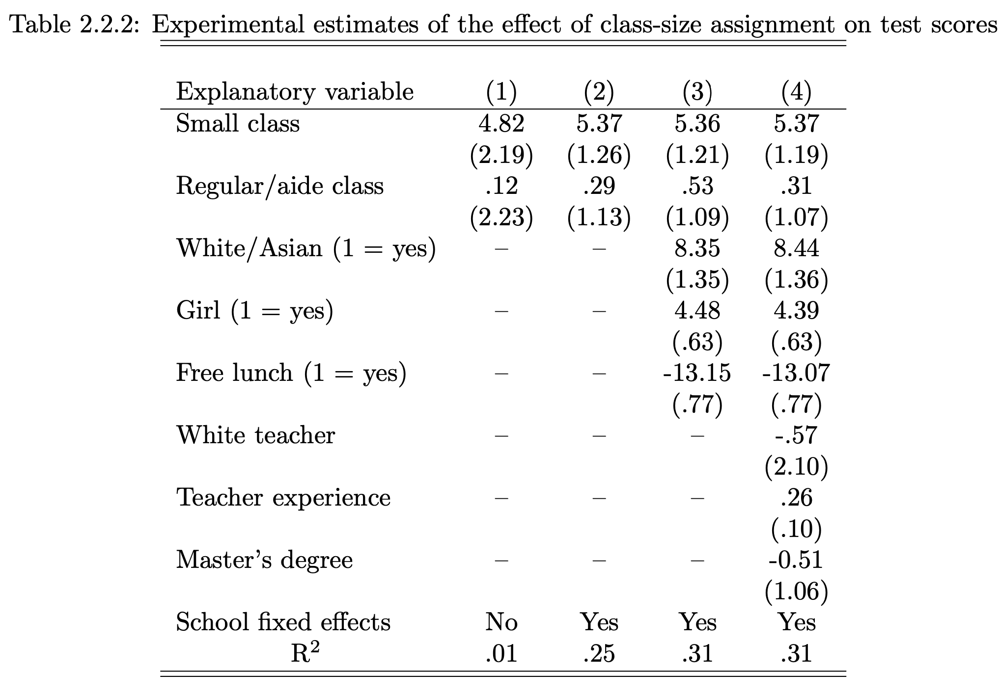

## Before class

- Angrist and Pischke, *Mostly Harmless Econometrics*, Chapters 1–3 [@angrist2009mostly].
- Jurajda, *Lecture Notes on Identification Strategies* [@jurajda2007identification].
- Timmins and Schlenker, “Reduced-Form Versus Structural Modeling in Environmental and Resource Economics” [@timmins2009reduced].

Readings and course handouts are available on [Canvas](https://colostate.instructure.com/courses/230315/pages/readings).

## Start with four questions

1. What relationship are you trying to learn about?
2. What would the ideal experiment look like?
3. What identification strategy is feasible?
4. How will you quantify uncertainty?

Source: @angrist2009mostly.

## Structural and reduced-form approaches

| Structural | Reduced-form / design-based |
|:---|:---|
| Specifies behavioral relationships | Focuses on variation identifying an effect |
| Recovers parameters within a model | Often targets a treatment or policy effect |
| Can support model-based counterfactuals | Often speaks most directly to the studied setting |

Both require assumptions. Their usefulness depends on the question.

Source: @timmins2009reduced.

## What a structural model adds

- Agents, objectives, constraints, and interactions.
- Parameters with a behavioral interpretation.
- A way to trace feedback and equilibrium responses.
- A framework for welfare or unobserved policy counterfactuals.

Identification still requires informative data and defensible restrictions.

## Example: vehicle policy

The source slides use fuel-economy regulation versus fuel taxation.

A model may need:

- Firms' new-vehicle decisions.
- Household vehicle choice and driving.
- Used-vehicle markets and scrappage.
- Interactions across these decisions.

Which effects would a simple comparison of new-car fuel economy miss?

::: notes
Adapted from Unit 6, slides 6–8 and the discussion of Jacobsen in Timmins and Schlenker. Focus on the mechanism rather than presenting uncited numerical results.
:::

## Structural tradeoffs

**Potential gains:** explicit mechanisms, feedbacks, welfare analysis, counterfactual simulation.

**Challenges:** specification, computational demands, identification, and sensitivity to behavioral assumptions.

A counterfactual prediction is conditional on the model remaining appropriate.

## What reduced-form designs emphasize

- A clearly defined outcome and treatment.
- A credible comparison.
- Institutional knowledge about assignment.
- Variation that isolates the relationship of interest.

Fixed effects, thresholds, instruments, and random assignment are possible tools, not automatic guarantees.

## Discussion: Timmins and Schlenker

For your proposed question:

- Is the goal an effect in an observed setting or a new policy counterfactual?
- Which behavioral responses must be represented?
- Which assumptions would each approach require?
- Could the approaches provide complementary evidence?

## Outcomes we cannot observe together

Let $Y_i(1)$ be an individual's outcome under treatment and $Y_i(0)$ under no treatment.

$$
Y_i=D_iY_i(1)+(1-D_i)Y_i(0)
$$

We observe only one potential outcome for each individual.

The missing counterfactual is the central problem.

## Selection contaminates a raw comparison

$$
\begin{aligned}
E[Y\mid D=1]-E[Y\mid D=0]
&=E[Y(1)-Y(0)\mid D=1]\\
&\quad+E[Y(0)\mid D=1]-E[Y(0)\mid D=0].
\end{aligned}
$$

The first term is the average treatment effect on the treated. The remaining difference is selection bias.

## Example: hospitals and health

People who visit hospitals may have worse health than those who do not.

- Does that establish that hospitals worsen health?
- What would their health have been without treatment?
- Which selection process makes the raw comparison misleading?

Source: @angrist2009mostly.

## What random assignment gives us

Under random assignment:

$$
D\;\perp\;(Y(0),Y(1)).
$$

With consistency and no interference, the population difference in means identifies the average treatment effect.

Randomization makes groups comparable **in expectation**; a realized sample can still be imbalanced.

::: notes
Corrects Unit 6, slide 24: assignment is independent of potential outcomes, not necessarily of the observed outcome. Imperfect compliance and attrition require additional analysis.
:::

## Regression does not remove selection by itself

In a model such as

$$Y_i=\alpha+\tau D_i+X_i'\beta+\varepsilon_i,$$

a causal interpretation of $\tau$ needs assumptions about treatment assignment and the error term.

Controls can help with comparability or precision. They can also introduce problems if chosen without a causal argument.

## Read the experimental table

{height=440px}

Source: Angrist and Pischke; retained from Unit 6, slide 26.

## Discussion: what changes across columns?

- Which coefficients are stable?
- What happens to standard errors?
- How can controls improve precision in an experiment?
- What would a large change in the treatment coefficient prompt you to investigate?

Start with the table's sample, units, and assignment process.

## Omitted-variable bias

Suppose the population model is

$$Y=\alpha+\beta X+\gamma Z+u,$$

but we omit $Z$. Under the usual exogeneity conditions,

$$
\operatorname{plim}\hat\beta_{\text{short}}
=\beta+\gamma\frac{\operatorname{Cov}(X,Z)}{\operatorname{Var}(X)}.
$$

Both the outcome relevance of $Z$ and its association with $X$ matter.

## Discussion: Jurajda

Choose one identification example from the notes.

- Where does the relevant variation come from?
- Why is a simple group comparison insufficient?
- What institutional detail supports the design?
- What alternative explanation remains?

## Can you describe the ideal experiment?

Specify treatment, population, assignment, outcome, and follow-up period.

If the treatment itself is ambiguous, refine the question first.

::: notes
Preserves the source speaker-note example: changing school-start age may also change schooling duration or age at testing. Ask students which effect their hypothetical experiment would isolate.
:::

## Workshop: your identification statement

Complete:

- “The relationship of interest is …”
- “The ideal experiment would …”
- “The feasible comparison is …”
- “Its causal interpretation requires …”
- “The largest remaining threat is …”

## Before you leave

Explain why a precisely estimated coefficient can still answer the wrong causal question.

## References {.smaller}

::: {#refs}
:::

## Course navigation

- [All lectures](lectures.qmd)
- [Schedule and preparation](../2026/schedule.qmd)
- [Course reading list](../2026/readings.qmd)
