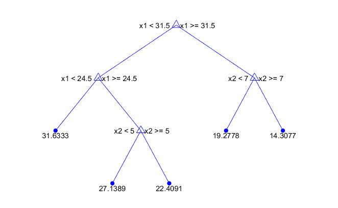

## Before class

- Athey and Imbens, “Machine Learning Methods That Economists Should Know About” [@athey2019machine].

Readings and course handouts are available on [Canvas](https://colostate.instructure.com/courses/230315/pages/readings).

## Begin with the task

Are we trying to:

- Predict an outcome?
- Describe patterns?
- Estimate a causal effect?
- Learn how effects vary?

The task determines how success should be evaluated.

Source: @athey2019machine.

## Prediction and causality

A model can predict outcomes well using variables that do not cause them.

A causal question asks how outcomes change under an intervention.

Predictive accuracy alone does not justify changing a policy variable.

## Supervised and unsupervised learning

- **Supervised:** learn a relationship between inputs and observed outcomes.
- **Unsupervised:** find structure without an outcome label.

Examples: predicting demand versus grouping similar observations.

Both can contribute to economic research when the role is explicit.

## Overfitting

A flexible model can fit noise in its training sample.

- Evaluate performance on observations not used to fit the model.
- Keep the final test set separate from model selection.
- Respect the dependence structure when splitting data.

For forecasting, information from the future should not enter training.

## Bias and variance

Greater flexibility may reduce approximation bias while increasing variability.

Regularization constrains the fit to improve performance outside the training sample.

The best training fit is not necessarily the best predictive model.

## LASSO

A common form minimizes

$$
\frac{1}{n}\sum_{i=1}^{n}(Y_i-\alpha-X_i'\beta)^2
+\lambda\sum_{j=1}^{p}|\beta_j|.
$$

- The penalty shrinks coefficients and may set some to zero.
- The tuning parameter controls the penalty.
- Cross-validation can guide predictive tuning.

## Trees and forests

A regression tree splits observations into groups with different predicted outcomes.

A random forest averages predictions across many randomized trees.

{height=260px}

Source: Unit 6, slide 43.

## Exercise: identify leakage

A model predicts whether a household will miss a payment.

One input is “number of collection calls made during the following month.”

- Why might this variable predict well?
- Could it be known at prediction time?
- How would you redesign the evaluation?

This is a hypothetical example.

## Model selection and confounding

Selecting variables only for predicting the outcome can omit variables important for treatment assignment.

The reading discusses selecting predictors of both outcome and treatment, then using their union in an appropriate estimation procedure.

This still depends on the underlying identification assumptions.

## Machine learning within a causal design

Flexible methods may estimate nuisance relationships such as:

- Expected outcomes conditional on covariates.
- Treatment probabilities.

Sample splitting and specialized inference can help manage overfitting.

Machine learning does not supply exogenous variation by itself.

## Discussion: Athey and Imbens

- Where can prediction tools improve an economic research workflow?
- Why is ordinary predictive validation insufficient for a causal claim?
- What is the difference between selecting controls and identifying treatment effects?
- Which example in the reading would be useful for your project?

## Workshop: evaluation plan

Specify:

1. Your task and target.
2. Available predictors.
3. A simple baseline.
4. A training/validation/test strategy.
5. A performance measure.
6. One plausible leakage path.

## Before you leave

Complete: “This method can improve ___, but it does not by itself establish ___.”

## References {.smaller}

::: {#refs}
:::

## Course navigation

- [All lectures](lectures.qmd)
- [Schedule and preparation](../2026/schedule.qmd)
- [Course reading list](../2026/readings.qmd)
