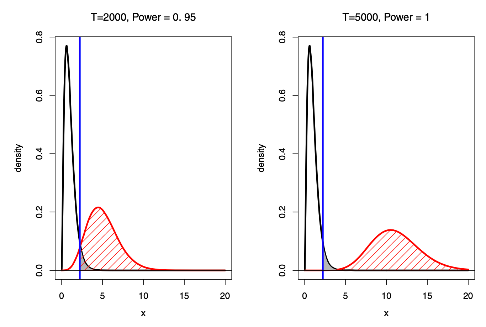

## Before class

- Gibson, “Are You Estimating the Right Thing? An Editor Reflects” [@gibson2019estimating].
- Kim, “Tackling False Positives in Business Research: A Statistical Toolbox with Applications” [@kim2019falsepositives].

Readings and course handouts are available on [Canvas](https://colostate.instructure.com/courses/230315/pages/readings).

## Credibility involves more than identification {.dense}

A strong design can still estimate a quantity different from the one the researcher intends.

Check:

- Research question.
- Estimand.
- Measurement.
- Population.
- Interpretation.

Source: @gibson2019estimating.

## Does the measure match the concept?

- Does a registry describe residents or registered persons?
- Does expenditure reflect quantity, quality, or both?
- Does infrequent recall obscure variation within a period?
- Does aggregation hide the response of interest?

Institutional knowledge of the data matters.

## Avoid discarding information unnecessarily

A continuous measure can be converted into an indicator, but that discards information.

Example: income versus an indicator for income below a poverty threshold.

Explain why the indicator matches the question. Consider how measurement error near the cutoff changes classification.

## Spatial processes cross boundaries

A policy in one area may affect neighbors.

- Does the outcome depend on nearby exposure?
- Could the comparison group be affected?
- Does the estimated effect include spillovers?
- Does aggregation hide them?

Match the model and interpretation to the spatial process.

## Discussion: Gibson

- Which example most clearly separates the intended and estimated quantity?
- Where does the problem enter: measurement, sample, design, or interpretation?
- Would a larger dataset solve it?
- Where would your project benefit most from additional effort?

::: notes
The source notes raise critiques of design-focused research. Treat them as questions about research priorities, not as a claim that all experimental designs require the same assumptions as all structural models.
:::

## Statistical significance answers a limited question

A p-value is the probability, under the null model, of a test statistic at least as extreme as the observed statistic.

It is not:

- The probability that the null is true.
- The probability that the result will replicate.
- The economic importance of the effect.

## Type I error, Type II error, and power

| Decision | Null true | Specified alternative true |
|:---|:---|:---|
| Reject null | Type I error | Correct rejection |
| Do not reject | Correct non-rejection | Type II error |

- $\alpha$: probability of Type I error.
- $\beta$: probability of Type II error under a specified alternative.
- Power: $1-\beta$.

## Sample size changes power {.dense}

{height=350px}

Source: Kim; retained from Unit 6, slide 71.

With a valid fixed-level test, increasing sample size does not inherently increase the nominal Type I error rate.

::: notes
Corrects the original large-sample discussion. Larger samples increase power against fixed alternatives. Misspecification, multiple testing, or interpreting tiny effects as important are separate problems.
:::

## Statistical and economic importance

A very small effect may be precisely estimated.

Ask:

- What is the estimate in meaningful units?
- What range is compatible with the data and assumptions?
- What effect would matter for the decision?
- Could the result be a precise estimate of a biased quantity?

## Discussion: Kim's diagnosis

- Why does Kim object to relying on a single significance threshold?
- Which concerns involve sample size, measurement, or model misspecification?
- Which involve repeated testing or selective reporting?
- What would a useful statistical toolbox add?

## Large samples do not erase bias

More observations can reduce variance while leaving systematic error.

$$
\operatorname{MSE}(\hat\theta)
=\operatorname{Var}(\hat\theta)
+\operatorname{Bias}(\hat\theta)^2.
$$

Precision can make a biased estimate look convincing.

## Bayesian evidence asks another question

A Bayes factor compares the marginal likelihood of the data under two models.

Posterior odds equal prior odds times the Bayes factor.

Neither a Bayes factor nor a posterior probability is the same as a p-value. State the hypotheses and prior assumptions.

## Error costs and decision thresholds

An illustrative expected-loss criterion is

$$
L=\pi_0 C_I\alpha+(1-\pi_0)C_{II}\beta,
$$

where $\pi_0$ is the prior probability of the null and $C_I,C_{II}$ are the costs of the two errors.

Choosing a threshold involves the decision context and the test's operating characteristics.

Source: discussion in @kim2019falsepositives.

## Equivalence is not failure to reject

A nonsignificant test against zero does not establish that the effect is negligible.

Equivalence testing instead specifies a substantively meaningful interval $(-\Delta,\Delta)$.

The question is whether evidence supports the effect lying inside that interval.

Choose $\Delta$ using the economic question.

## Exercise: interpret two findings

**Hypothetical findings:**

- Study A: estimated effect $0.01$, interval $[0.009,0.011]$.
- Study B: estimated effect $1.0$, interval $[-0.2,2.2]$.

What can you say about precision, compatibility with zero, and economic importance?

What units and decision context are missing?

## A transparent methods section

Report:

- Model and target parameter.
- Sample and variable construction.
- Source of identifying variation.
- Controls and their justification.
- Inference procedure.
- Planned sensitivity analyses.

Source: Unit 6, slides 85–89.

## Discussion: use both readings

A paper reports a small p-value from a large administrative dataset.

Give one question from Gibson and one from Kim that you would ask before accepting the conclusion.

Explain why each question concerns a different part of the argument.

## Workshop: an evidence audit

For your proposal:

1. State the estimand in words.
2. Check whether the measure matches it.
3. Identify the largest source of systematic error.
4. Define an economically meaningful effect.
5. Explain how you will report uncertainty.

## Before you leave

Name one conclusion that should not be drawn from a small p-value alone.

## References {.smaller}

::: {#refs}
:::

## Course navigation

- [All lectures](lectures.qmd)
- [Schedule and preparation](../2026/schedule.qmd)
- [Course reading list](../2026/readings.qmd)
